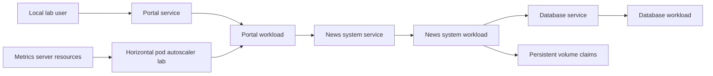

# Architecture

## Scope

This repository is an educational Kubernetes lab. The manifests explore multiple resource types around a small news application example.

The documentation describes the current files without changing or certifying them for production use.

## Application Components

| Component | Purpose in the lab | Main resources |
| --- | --- | --- |
| Database | MySQL-compatible data service for the news system example. | `db-noticias*.yaml`, `svc-db-noticias.yaml`, `db-configmap.yaml` |
| News system | Internal application component that connects to the database. | `sistema-noticias*.yaml`, `svc-sistema-noticias.yaml`, `sistema-configmap.yaml` |
| News portal | User-facing portal example. | `portal-noticias*.yaml`, `svc-portal-noticias.yaml`, `portal-noticias-configmap.yaml` |
| Metrics server | Cluster metrics resources used by autoscaling exercises. | `components.yaml` |
| Storage examples | Persistent volumes, claims, storage classes, and volume mounting exercises. | `pv.yaml`, `pvc*.yaml`, `sc.yaml`, `pod-pv.yaml`, `pod-volume.yaml`, `imagens-pvc.yaml`, `sessao-pvc.yaml` |
| Load helper | Local request loop for observing scaling behavior in a lab. | `stress.sh` |

## Resource Inventory

- Pods
- Deployments
- ReplicaSet
- StatefulSet
- Services using `ClusterIP` and `NodePort`
- ConfigMaps
- PersistentVolume
- PersistentVolumeClaims
- StorageClass
- HorizontalPodAutoscaler
- Metrics server resources, including RBAC and API service objects

## Conceptual Flow

## Important Boundary

The manifests intentionally remain unchanged in this documentation PR. Some files represent different stages of study rather than one deployable bundle. Apply only the specific manifests required for the exercise being performed.

## Production Considerations

Before adapting any material for production:

- Replace hardcoded credentials with Kubernetes Secrets or an external secret manager.
- Remove environment-specific endpoints.
- Review RBAC permissions and TLS configuration.
- Pin and update container images.
- Validate API versions against the target cluster.
- Define namespaces, resource limits, backup, observability, and rollout policies.
